  <picture>
    <source media="(max-width: 580px), (min-width: 768px) and (max-width: 870px)" srcset="hero-mobile.svg">
    
  </picture>

Fullstack engineer. I work across web and Apple platforms, and on the side I design in CAD and build hardware. My most-starred project is a working Pip-Boy 3000 built around a Raspberry Pi.

  <picture>
    <source media="(max-width: 580px), (min-width: 768px) and (max-width: 870px)" srcset="stack-mobile.svg">
    
  </picture>

  <a href="https://github.com/ColtonMcCasland/Raspipboy-3000">
    <picture>
      <source media="(max-width: 580px), (min-width: 768px) and (max-width: 870px)" srcset="featured-mobile.svg">
      
    </picture>
  </a>

- **Interface**: Python and pygame at 480×320, adapted from [sabas1080/pypboy](https://github.com/sabas1080/pypboy)
- **Controls**: two rotary encoders and three front LEDs on the GPIO header
- **Map and radio**: maps drawn from OpenStreetMap data, and a radio with selectable stations
- **Power and audio**: PowerBoost 1000C with a LiPo cell, PAM8302 amp and speaker
- **Enclosure**: modified [ytec3d Pip-Boy](https://ytec3d.com/pip-boy/) model, 3D files in the repo

[Repository](https://github.com/ColtonMcCasland/Raspipboy-3000) · [Demo on Reddit](https://www.reddit.com/r/RASPBERRY_PI_PROJECTS/comments/10emism/pipboy3000_raspberry_pi/)

Public repositories

| Repo | Language | Last push |
| :-- | :-- | :-- |
| [Raspipboy-3000](https://github.com/ColtonMcCasland/Raspipboy-3000) | Python | 2024 |
| [Mario-game-in-Java](https://github.com/ColtonMcCasland/Mario-game-in-Java) | Java | 2021 |
| [flutter_weather_pin](https://github.com/ColtonMcCasland/flutter_weather_pin) | Dart (Flutter) | 2019 |
| [MobileFinal_openWeatherPinApp](https://github.com/ColtonMcCasland/MobileFinal_openWeatherPinApp) | Dart (Flutter) | 2019 |
| [MobileProgrammingAssignment4](https://github.com/ColtonMcCasland/MobileProgrammingAssignment4) | Dart (Flutter) | 2019 |
| [TODOAPP-Flutter](https://github.com/ColtonMcCasland/TODOAPP-Flutter) | Dart (Flutter) | 2019 |
| [PF2-Summer-2018](https://github.com/ColtonMcCasland/PF2-Summer-2018) | C++ | 2019 |
| [paradigms](https://github.com/ColtonMcCasland/paradigms) | HTML, JavaScript | 2018 |

Forks: [mlx](https://github.com/ColtonMcCasland/mlx), Apple's array framework for Apple silicon, and [QuadrupedRobot](https://github.com/ColtonMcCasland/QuadrupedRobot), Mangdang's open-source robot dog kit.

  <a href="https://linkedin.com/in/colton-mccasland-518519114">
    <picture>
      <source media="(max-width: 580px), (min-width: 768px) and (max-width: 870px)" srcset="contact-mobile.svg">
      
    </picture>
  </a>

